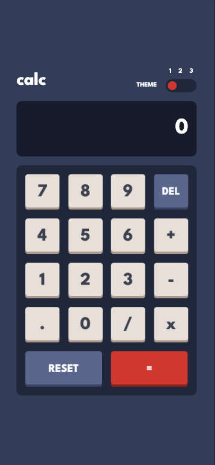
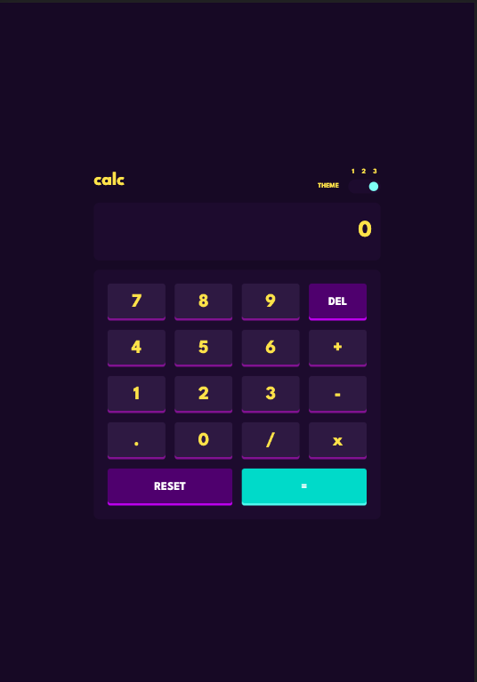
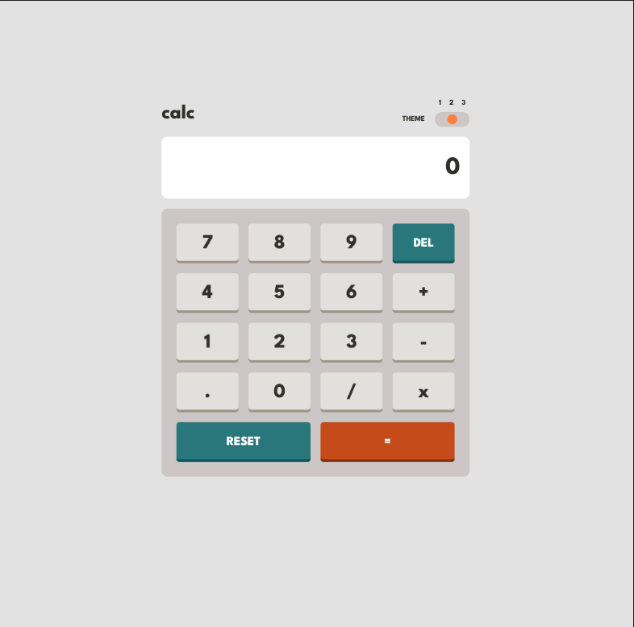

# Frontend Mentor - Calculator app solution

This is a solution to the [Calculator app challenge on Frontend Mentor](https://www.frontendmentor.io/challenges/calculator-app-9lteq5N29). Frontend Mentor challenges help you improve your coding skills by building realistic projects.

## Table of contents

- [Overview](#overview)
  - [The challenge](#the-challenge)
  - [Screenshot](#screenshot)
  - [Links](#links)
- [My process](#my-process)
  - [Built with](#built-with)
  - [What I learned](#what-i-learned)
  - [Continued development](#continued-development)
  - [Useful resources](#useful-resources)
- [Author](#author)
- [Acknowledgments](#acknowledgments)

## Overview

### The challenge

Users should be able to:

- See the size of the elements adjust based on their device's screen size
- Perform mathmatical operations like addition, subtraction, multiplication, and division
- Adjust the color theme based on their preference
- **Bonus**: Have their initial theme preference checked using `prefers-color-scheme` and have any additional changes saved in the browser

### Screenshot





### Links

- Solution URL: [solution](https://github.com/btebe/calc-app)
- Live Site URL: [live app](https://your-live-site-url.com)

## My process

### Built with

- Semantic HTML5 markup
- CSS custom properties
- Flexbox
- CSS Grid
- Mobile-first workflow

### What I learned

This project was not very challenging. i thought the tri-state-toggle would put me in a twist, but when broken down, its very easy.

To see how you can add code snippets, see below:

```html
<div class="tri-state-toggle">
  <input class="btn-theme" type="radio" name="toggle" id="one" />
  <input class="btn-theme" type="radio" name="toggle" id="two" />
  <input class="btn-theme" type="radio" name="toggle" id="three" />
</div>
```

### Continued development

I wish to continue to further challenge my css skills.

### Useful resources

- [Example resource 1](https://webcodespace.com/how-to-create-a-three-state-toggle-switch-using-html-css-and-javascript) - This helped me understand the tri-toggle-state

## Author

- Website - [Basma Tebe](https://basma94tebe.wixsite.com/my-site)
- Frontend Mentor - [@btebe](https://www.frontendmentor.io/profile/btebe)

## Acknowledgments

I would like to give a big thanks to all the developers on the web.
